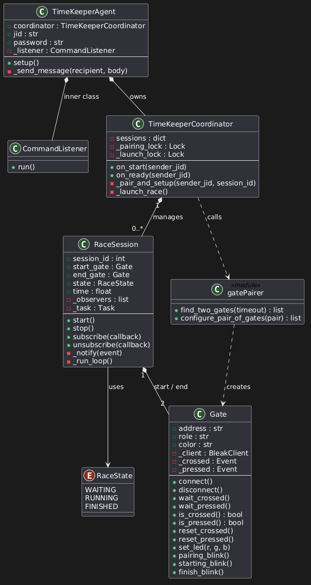

# Timekeeper

Agent externe, hosté sur le raspberry Pi `coordinator`, pour la gestion des chronos et des portiques BLE

## Règles concernant la BLE

Après discussions avec Mr. Calvaresi, les modalités suivantes ont été conclues :

- les portiques seront positionnées dans des culs-de-sac
- Si un robot trigger le mauvais portique de fin -> disqualification
- Un seul agent timer pour les deux équipes (sur le Raspberry Pi)

## Architecture

### Diagramme de classes



### Etape de fonctionnement
0. Avoir allumer au moins 2 portiques Thingy:52
1. Logger envoie `Hello TimeKeeper ! Please initialise a race.`
2. TimeKeeper scanne les portiques BLE et les mets en mode appariements
    -  Lorsque les portiques clignotent en blanc, pressez successivement leur bouton pour définir leur rôle (ler = start, 2ème = end)
3. TimeKeeper confirme le processus et envoi `paired start:{color} end:{color}`
4. Quand on souhaite démarrer la course :  Logger envoie `I'm ready to race !`
5. Dès que toutes les équipes sont prêtes, le TimeKeeper déclenchent le compte à rebours
6. Le chrono de temps de course total se déclenche lorsque le `Go!!` est envoyé
7. Les chronos individuels se déclenche au moment ou le laser du départ est coupé
8. Les chronos individuels se terminent au momement ou le laser d'arrivé est coupé
9. Le chrono de temps de cours total s'arrête au moment ou le dernier concurrent franchi la ligne 
10. Le TimeKeeper envoie les chronos individuels et le chrono total à chaque concurent.
11. Les portes sont déconnectées

## Infrastructure XMPP

- **Serveur :** Prosody sur `isc-coordinator2.lan`
- **Comptes utilisables déjà enregistrés lors de tests :**

| JID | Usage |
|-----|-------|
| `timekeeper@isc-coordinator2.lan` | Agent TimeKeeper |
| `navigator@isc-coordinator2.lan` | Logger équipe 1 |
| `navigator2@isc-coordinator2.lan` | Logger équipe 2 |

## Utilisation

### Lancer le docker
```bash
# depuis le dossier desktop/Timekeeper du coordinator
docker compose up --build
```

### Protocole XMPP — messages exacts acceptés TimeKeeper

| Message envoyé au TimeKeeper | Effet |
|------------------------------|-------|
| `Hello TimeKeeper ! Please initialise a race.` | Démarre une session, lance le scan BLE et le pairing |
| `I'm ready to race !` | Marque la session comme prête ; lance la course dès que toutes les équipes sont prêtes |

## Données des portiques
*Tiré des [slides fournies](https://isc.hevs.ch/learn/pluginfile.php/7945/mod_resource/content/0/05%20Introduction%20to%20Bluetooth%20LE.pdf)*

### Spécifications Techniques : Thingy:52 (Custom Firmware)

*   **Plateforme :** Basé sur le Nordic Thingy:52 IoT.
*   **Firmware :** Custom, basé sur **Zephyr RTOS**.
*   **Service Propriétaire :** Gère le capteur IR, le bouton et la LED RGB.
    *   **Service UUID :** `794f1fe3-9be8-4875-83ba-731e1037a880`

#### Caractéristiques GATT

*   **Capteur IR**
    *   **UUID :** `794f1fe3-9be8-4875-83ba-731e1037a883`
    *   **Opération :** Notification
    *   **Données :** `UInt8` (1 octet) — `1` si un objet est détecté, `0` sinon.

*   **Bouton**
    *   **UUID :** `794F1fE3-9BE8-4875-83BA-731E1037A881`
    *   **Opération :** Notification
    *   **Données :** `UInt8` (1 octet) — `1` si pressé, `0` sinon.

*   **RGB LED**
    *   **UUID :** `794F1fE3-9BE8-4875-83BA-731E1037A882`
    *   **Opération :** Write without response
    *   **Données :** `UInt8[3]` (3 octets) — Intensité R-G-B (0-255).